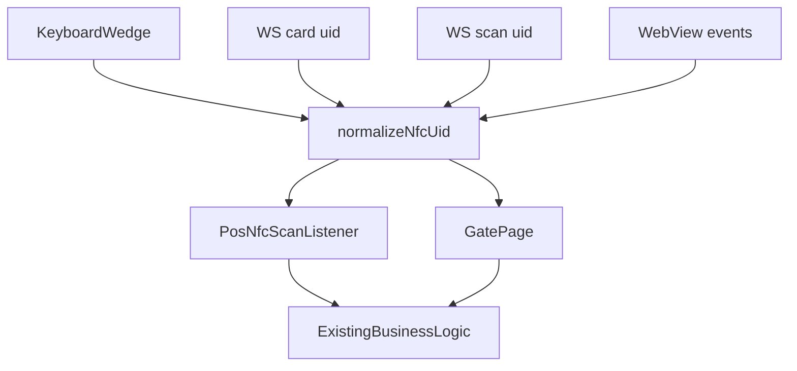

# POS NFC Multi-Source Ingest

**Date:** 2026-08-04  
**Status:** Implemented

## Goal

Keep the existing Arkiv NFC flows while accepting the newer POS mock / WebView
trial contracts. All scan sources resolve to the same UID string before reaching
the existing cashier, topup, and ticketing gate logic.

## Sources

| Source | Payload | Arkiv handling |
| --- | --- | --- |
| Keyboard wedge | UID characters + `Enter` | Existing `PosNfcScanListener` buffer |
| Arkiv PC/SC bridge | `{ "type": "card", "uid": "04A1B2C3" }` | Existing WebSocket URL, parsed as card |
| Desktop trial bridge | `{ "type": "scan", "uid": "04A1B2C3" }` | Same WebSocket URL, parsed as card |
| WebView contract | `arkiv-nfc-scan` / `window.arkivNfc.onScan` | WebView ingest hook |
| POS mock alias | `__posMockOpenScanDialog`, `__posMockEmitNfcScan`, `pos-mock-nfc-scan` | WebView ingest hook |

## Contract

Long-term WebView contract:

```js
window.arkivNfc.onScan((uid) => {
  // UID is forwarded to Arkiv POS NFC routing.
});

window.dispatchEvent(
  new CustomEvent("arkiv-nfc-scan", { detail: { uid: "04A1B2C3" } })
);
```

Compatibility aliases are kept so the current Flutter WebView trial injector can
load Arkiv without changing its emitted `__posMock*` calls.

## Routing



UIDs are normalized at the consumer boundary: trim, remove non-alphanumeric
characters, and uppercase. This preserves the old uppercase hex bridge output
while accepting separators from WebView or desktop trial sources.

## Operational Notes

- Only one WebSocket bridge can bind `ws://127.0.0.1:8787` on a device.
- Cashier/topup/member lookup behavior remains owned by the existing POS code.
- Gate taps keep their own debounce and API path.

## Out Of Scope

- Changing Flutter WebView code.
- Changing `nfc-bridge-desktop` or `tools/pos-nfc-bridge` payloads.
- Adding reader status UI in Arkiv.
- Reworking ticketing loket, booking, gate-pass, or settings focused-input flows.
